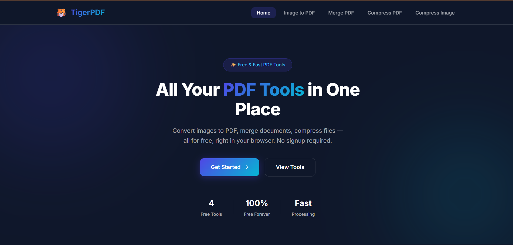
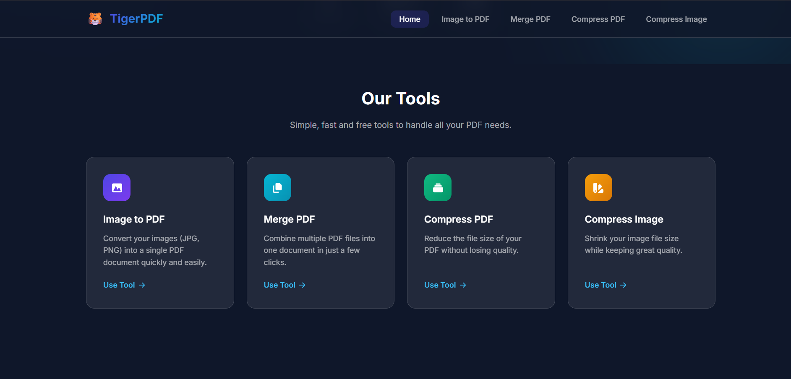
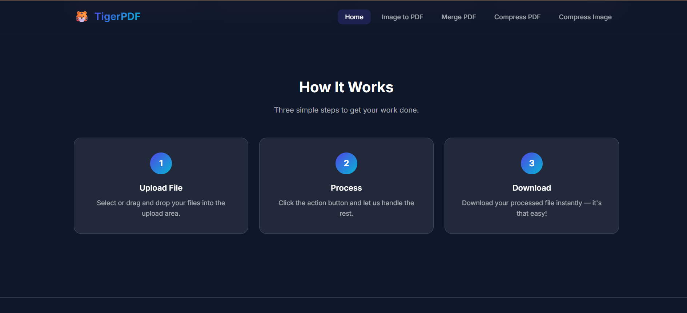
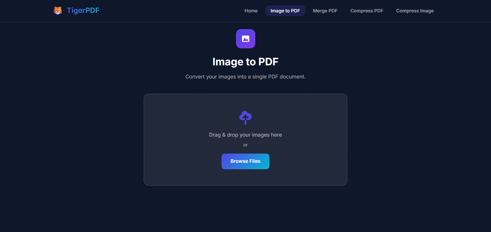
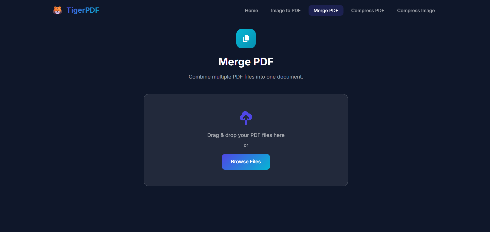
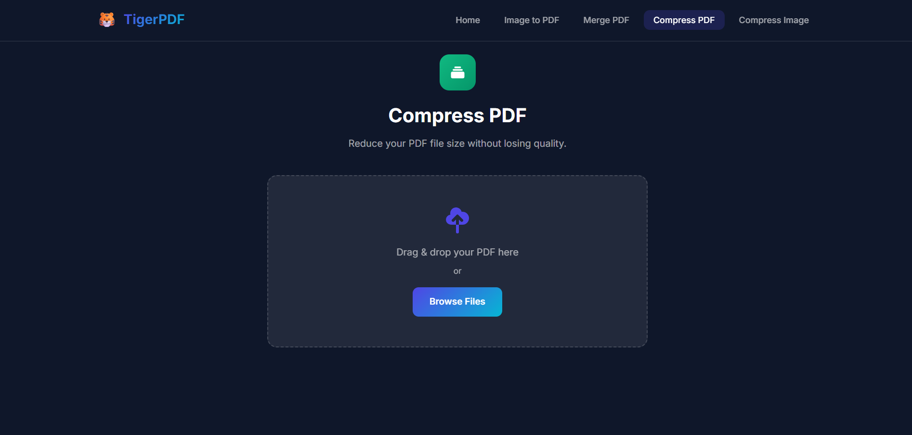
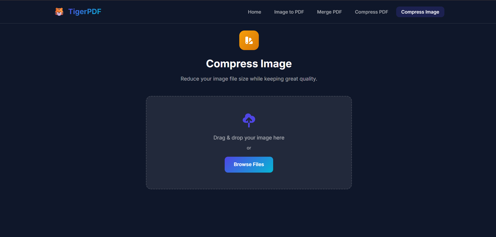

# 🐯 TigerPDF

### A Modern Full-Stack PDF Utility Web Application

Convert, Merge and Compress PDFs & Images with a clean, fast and responsive interface.

Built using **React.js**, **Node.js**, **Express.js**, **JavaScript**, **HTML5**, and **CSS3**.

---

# 📌 About the Project

TigerPDF is a modern full-stack PDF utility web application that provides commonly used PDF and image tools through a clean and responsive interface.

The project focuses on simplicity, speed and ease of use. Users can process PDF and image files directly from the browser without creating an account or storing personal data.

This project demonstrates practical full-stack web development skills using React.js for the frontend and Node.js with Express.js for the backend.

---

# ✨ Features

### 🖼️ Image to PDF

- Convert multiple images into one PDF
- Supports JPG, JPEG, PNG and WEBP
- Maximum 50 images
- Fast conversion
- Instant download

---

### 📄 Merge PDF

- Merge multiple PDF files
- Maximum 15 PDF files
- Preserve page order
- Instant download

---

### 📉 Compress PDF

- Compress PDF files
- One PDF at a time
- Reduce file size
- Instant download

---

### 🖼️ Compress Image

- Compress JPG, PNG and WEBP images
- Maintain image quality
- One image at a time
- Instant download

---

# 🚀 Tech Stack

## Frontend

- React.js
- JavaScript (ES6)
- HTML5
- CSS3
- React Router
- Axios
- React Icons

---

## Backend

- Node.js
- Express.js
- Multer
- Sharp
- PDF-Lib
- dotenv
- CORS

---

# 🎨 User Interface

- Modern Dark Theme
- Glassmorphism Design
- Responsive Layout
- Gradient Buttons
- Interactive Cards
- Drag & Drop Upload
- Mobile Friendly
- Desktop Friendly

---

# 📷 Project Screenshots

## 🏠 Hero Section



---

## 🛠️ Tools Section



---

## ⚡ How It Works



---

## 🖼️ Image to PDF



---

## 📄 Merge PDF



---

## 📉 Compress PDF



---

## 🖼️ Compress Image



---

# 📁 Project Structure

```text
TigerPDF
│
├── frontend
│   ├── public
│   ├── src
│   ├── package.json
│   └── vite.config.js
│
├── backend
│   ├── controllers
│   ├── routes
│   ├── middleware
│   ├── uploads
│   ├── server.js
│   └── package.json
│
└── README.md
```

---

# ⚙️ Installation

## Clone

```bash
git clone https://github.com/ayushpandey28/TigerPDF.git
```

## Frontend

```bash
cd TigerPDF/frontend
npm install
npm run dev
```

Runs on

```
http://localhost:5173
```

## Backend

```bash
cd TigerPDF/backend
npm install
npm run dev
```

Runs on

```
http://localhost:5000
```

---

# 🌐 API Endpoints

| Method | Endpoint | Description |
|---------|----------|-------------|
| POST | /api/image-to-pdf | Convert Images to PDF |
| POST | /api/merge-pdf | Merge PDF Files |
| POST | /api/compress-pdf | Compress PDF |
| POST | /api/compress-image | Compress Image |

---

# 📂 Upload Limits

| Tool | Limit |
|------|-------|
| Image to PDF | 50 Images |
| Merge PDF | 15 PDF Files |
| Compress PDF | 1 PDF |
| Compress Image | 1 Image |

---

# 🎯 Highlights

- Full-Stack Application
- Clean Folder Structure
- Responsive Design
- REST API Integration
- Drag & Drop Upload
- Modular Components
- Beginner-Friendly Code
- Interview Friendly

---

# 🔮 Future Improvements

- Split PDF
- Rotate PDF
- Watermark PDF
- Password Protected PDF
- PDF to Image
- Image Resize
- Dark / Light Theme
- Cloud Storage Support

---

# 🌐 Live Demo

Coming Soon...

---

# 👨‍💻 Author

**Ayush Pandey**

B.Tech Computer Science and Engineering

KIET Group of Institutions

GitHub:
https://github.com/ayushpandey28

---

# ⭐ Support

If you found this project useful, consider giving it a ⭐ on GitHub.

---

<div align="center">

## 🐯 TigerPDF

Built with ❤️ using React.js, Node.js and Express.js

</div>
